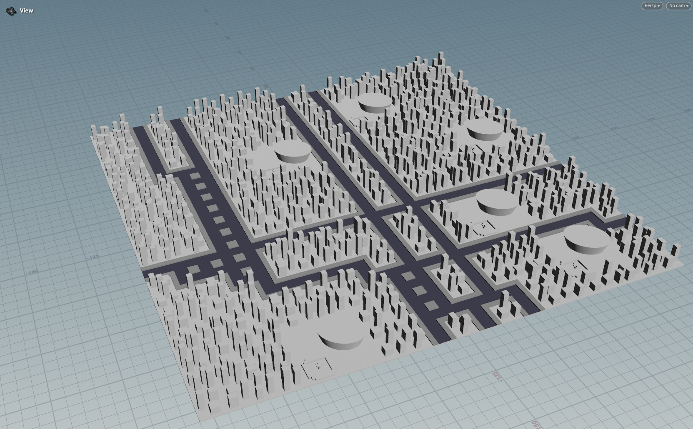

# Final Project!

## Design Doc

### Introduction
- After learning how to procedurally build a house in Houdini in my previous homework project, I began thinking about generating other structures procedurally. I considered what types of things can be procedurally generated and what kind of scene would best showcase procedurally built structures. This led me to the idea of procedurally generating a city.

### Goal
- The goal is to procedurally generate a city using Houdini.

### Inspiration/reference:
- Pictures:
    - 
    - 
- Videos:
    - [Procedural City](https://www.youtube.com/watch?v=xRqlCYz4I6I)
    - [City Generator](https://www.youtube.com/watch?v=ligKs9aXKsA)

### Specification:
- Procedurally generate layout of the city.
- Generate roads and buildings based on the layout.
- Optional: other urban features like grass and trees, people and cars

### Techniques:
- Houdini (the software to use)
- Noise functions and other toolbox functions
- Other procedural tools, such as L-systems

### Design:
- `generation engine` $\rightarrow$ `city's layout` $\downarrow$
- `components of roads and buildings` $\longrightarrow$ `procedurally generated city`

### Timeline:
- Week 1: Prepare materials and components, such as basic building models and road systems. Create a simple demo to explore combinations of different road layouts and buildings.
- Week 2: Develop the procedural generation engine for basic structures.
- Week 3: Refine the city generation by adding roads and buildings. Test and optimize the engine.
- Week 4: Finalize the project, addressing any remaining issues and removing unfinished elements.

## Milestone #1 (11/12)

Progress:

* Components are partially done. This is not totally done as I fail to figure out what are the components that I'm going to put into my city.

    After asking Adam for suggestions today (Wednesday, 11/12), I'm now somehow more clear and plan to make different block structures (with each one pretty simple) and then procedurally replace the white boxes and road models with those new structures.

* Procedural generator is basically working well. As the roads and boxes may generate on the grid dynamically now.

Here's the example output of my current procedural city generator.

## Milestone #2 or 3 (11/24)

Progress:

* Basic components are mostly done, coloring are in progress. The whole generator is mostly done.

    As suggested by Professor Rachel, more different types of structures should be added, and the buildings should have some kinds of random heights if possible. So these are the final goals I'm trying to accomplish before final submission.

* In progress generator (click to see demo video):

    